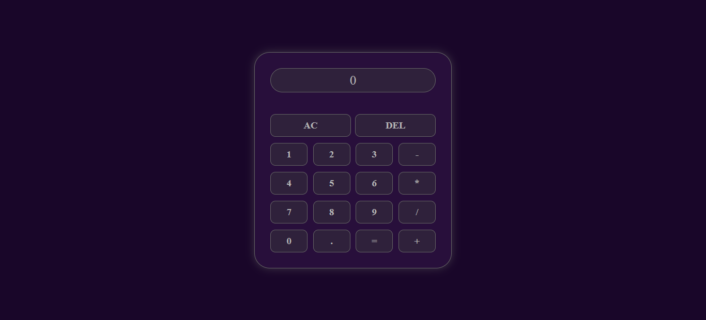

# Calculator-basic

## Descrição do projeto
Este projeto foi feito com intuito de estudo entre HTML, CSS e JavaScript.🚀

## Tecnologias utilizadas
* HTML5
* CSS3
* JAVASCRIPT

## Status do projeto
Finalizado!

## Features
- [x] Adição
- [x] Subtração
- [x] Multiplicação
- [x] Divisão  
  
## Aplicação

## Autor
Feito por Gilson Kedson.